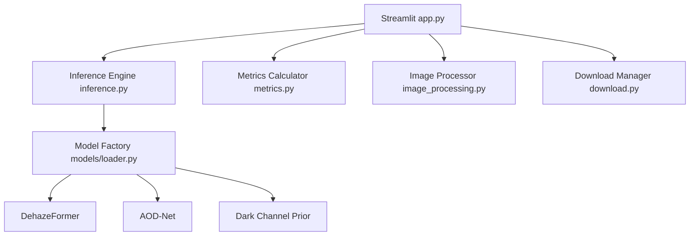
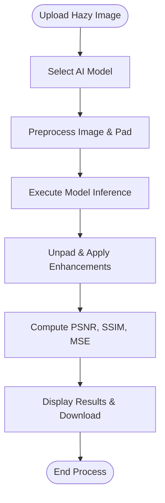
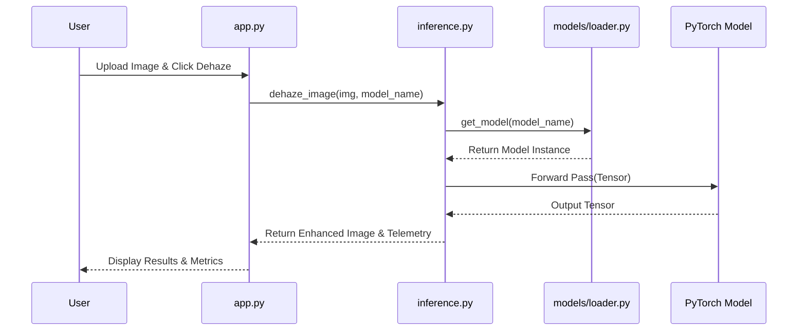
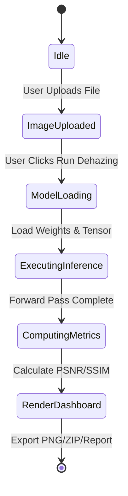
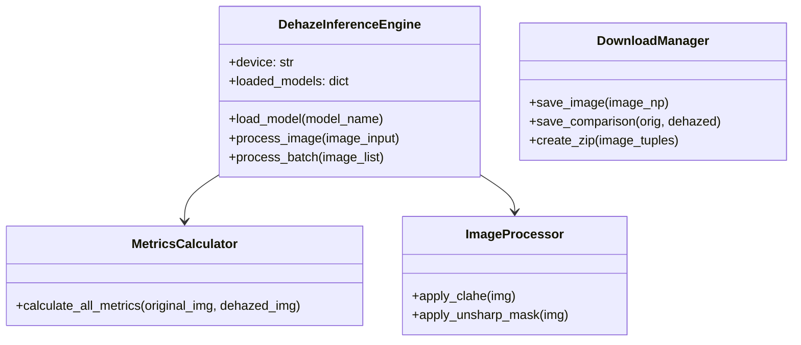

# Software Engineering UML Diagrams

## 1. System Architecture Diagram


## 2. Process Flowchart


## 3. Use Case Diagram
```mermaid
usecaseDiagram
    actor User
    User --> (Upload Image)
    User --> (Select Dehazing Model)
    User --> (Run Dehazing Inference)
    User --> (Adjust CLAHE / Sharpen Sliders)
    User --> (Inspect Quality Metrics & Histograms)
    User --> (Download Enhanced Image & Report)
```

## 4. Sequence Diagram


## 5. Activity Diagram


## 6. Class Diagram


## 7. Deployment Diagram

